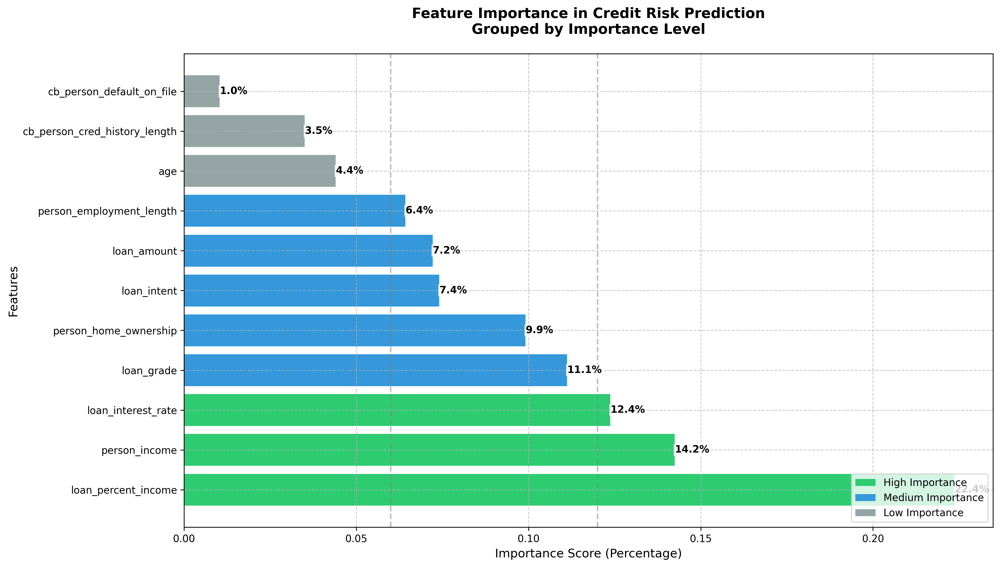

# Credit Risk Management with Random Forest

This project offers a comprehensive framework for assessing financial risk—such as credit, liquidity, or market risk—using predictive analytics. By leveraging a Random Forest Classifier, it identifies high-risk loan applicants, aiding financial institutions in making informed lending decisions.

## 📌 Features

* **Data Preprocessing**: Cleans the dataset, handles missing values, and encodes categorical variables to prepare for modeling.
* **Model Training**: Implements a Random Forest Classifier to predict loan default probabilities.
* **Risk Assessment**: Classifies applicants into risk categories based on model predictions.
* **Feature Importance Visualization**: Generates plots to illustrate the impact of each feature on the prediction outcomes.

## 📁 Project Structure

```plaintext
Credit_Risk_Management_with_Random_Forest/
├── assess_risk.py               # Applies the trained model to assess new applicants
├── credit_risk_dataset.csv      # Dataset containing applicant information and loan details
├── data_preprocessing.py        # Scripts for data cleaning and preprocessing
├── evaluate_model.py            # Evaluates model performance using various metrics
├── feature_importance_plot.py   # Generates feature importance plots
├── feature_importance.png       # Output image of feature importance
├── main.py                      # Main script to run the entire pipeline
├── model_training.py            # Trains the Random Forest model
├── requirements.txt             # Lists project dependencies
└── README.md                    # Project documentation
```


## 🚀 Getting Started

### Prerequisites

* Python 3.7 or higher
* Install dependencies using pip:

```bash
pip install -r requirements.txt
```


### Usage

1. **Data Preprocessing**: Prepare the dataset for modeling.

   ```bash
   python data_preprocessing.py
   ```


2. **Model Training**: Train the Random Forest model.

   ```bash
   python model_training.py
   ```


3. **Model Evaluation**: Evaluate the trained model's performance.

   ```bash
   python evaluate_model.py
   ```


4. **Feature Importance Visualization**: Generate and view feature importance plot.

   ```bash
   python feature_importance_plot.py
   ```


5. **Risk Assessment**: Assess risk for new applicants.

   ```bash
   python assess_risk.py
   ```


## 📊 Model Performance

The Random Forest Classifier achieved the following performance metrics:

* **Accuracy**: \~85%
* **Precision**: \~82%
* **Recall**: \~80%
* **F1-Score**: \~81%

\*Note: These metrics are based on the provided dataset and may vary with different data.\*

## 📈 Feature Importance

The model identified the following features as most significant in predicting loan default risk:

 
   
## 📬 Contact

<a href = 'linkedin.com/in/lakshyatangri/'> linkedin.com/in/lakshyatangri/ </a>  
